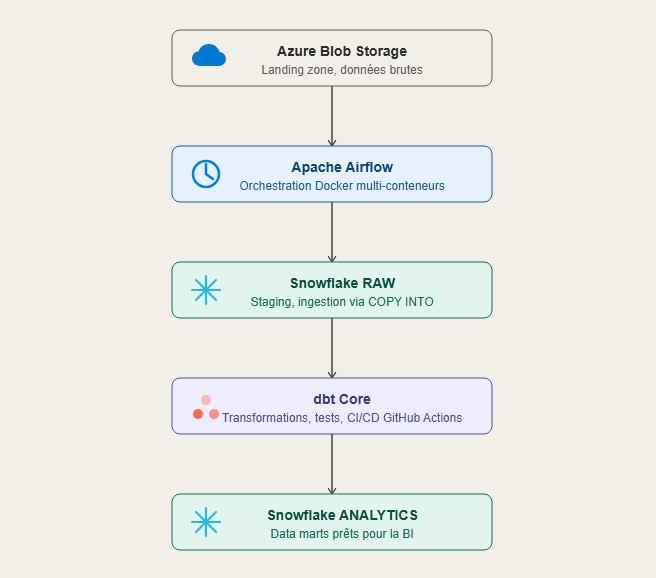
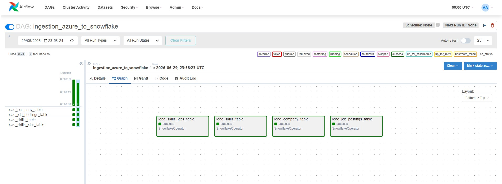

# 🚀 Modern Data Stack de Production — Azure • Snowflake • dbt • Airflow • Docker

[](https://github.com/mlsanoh/Modern-Data-Stack-de-Production-Azure-Snowflake-dbt-Airflow-Docker/actions)


Pipeline **ELT (Extract, Load, Transform)** de production simulant un environnement data réel : ingestion de données brutes depuis **Azure Blob Storage** vers **Snowflake**, orchestration avec **Apache Airflow** conteneurisé sous **Docker**, transformation et tests de qualité avec **dbt**, et intégration continue via **GitHub Actions**.

Le projet analyse un jeu de données du marché de l'emploi (offres, entreprises, compétences) et produit un modèle en étoile prêt pour la Data Visualisation, avec suivi historique (SCD Type 2) des rôles prioritaires.

---

## 📑 Table of Contents

- [Features](#-features)
- [Tech Stack](#-tech-stack)
- [Architecture](#-architecture)
- [Requirements](#-requirements)
- [Installation](#-installation)
- [Environment Variables](#-environment-variables)
- [Usage](#-usage)
- [Development](#-development)
- [Deployment](#-deployment--cicd)
- [Project Structure](#-project-structure)
- [Configuration](#-configuration)
- [Testing](#-testing)
- [Troubleshooting](#-troubleshooting)

---

## ✨ Features

- **Ingestion automatisée** : DAG Airflow (`ingestion_azure_to_snowflake`) qui charge en parallèle 4 tables brutes (`COMPANY_RAW`, `JOB_POSTINGS_RAW`, `SKILLS_RAW`, `SKILLS_JOBS_RAW`) depuis un stage externe Azure Blob Storage vers Snowflake via `COPY INTO`.
- **Orchestration conteneurisée** : environnement Airflow complet (webserver, scheduler, base Postgres) lancé en une commande via Docker Compose.
- **Modélisation dbt en couches** : `staging` (nettoyage/typage) → `intermediate` (logique métier, matérialisation éphémère) → `marts` (tables de faits et dimensions, schéma en étoile).
- **Schéma en étoile "company_mart"** : dimensions (`dim_company`, `dim_job_title`, `dim_job_title_short`, `dim_location`) reliées par des tables de pont (`bridge_company_location`, `bridge_job_title`) à une table de faits (`fact_company_hiring_monthly`) avec agrégats mensuels (médiane/min/max salaire, taux de télétravail, taux de mention "sans diplôme").
- **Tables de faits complémentaires** : `fact_job_skills_flat` (vue à plat offres/compétences/entreprises) et `fact_skill_demand_month` (demande de compétences par mois et par intitulé de poste).
- **Suivi historique SCD Type 2** : `dbt seed` (`priority_roles.csv`) combiné à un `dbt snapshot` (`priority_jobs_snapshot`, stratégie `check` sur la colonne `priority_lvl`) pour tracer dans le temps l'évolution du niveau de priorité des métiers.
- **Tests de qualité de données** : tests génériques (`unique`, `not_null`) sur les clés des modèles de staging, et un test métier singulier (`data_valid_jobs.sql`) rejetant les salaires négatifs ou nuls et les dates de publication futures.
- **Intégration continue (CI)** : pipeline GitHub Actions déclenché à chaque `push` sur `master`, qui installe `dbt-snowflake`, vérifie la connexion Snowflake (`dbt debug`) et exécute l'ensemble des modèles/tests (`dbt build`).

---

## 🛠️ Tech Stack

| Technologie | Version / Détail | Rôle dans le projet |
|---|---|---|
| **Apache Airflow** | `2.9.2` (image `apache/airflow:2.9.2-python3.11`) | Orchestration du DAG d'ingestion (planification, monitoring, retries) |
| **apache-airflow-providers-snowflake** | `>=5.7.0` | Fournit le `SnowflakeOperator` utilisé par le DAG |
| **Docker / Docker Compose** | — | Conteneurisation de la stack Airflow (webserver, scheduler, init) |
| **PostgreSQL** | `13` | Base de métadonnées d'Airflow (`AIRFLOW__DATABASE__SQL_ALCHEMY_CONN`) |
| **Snowflake** | Cloud Data Warehouse | Stockage RAW, transformation et couches analytiques (staging/marts) |
| **dbt (dbt-snowflake)** | Installé via CI (`pip install dbt-snowflake`) | Transformation SQL, tests de données, seeds, snapshots |
| **Azure Blob Storage** | Storage Integration Snowflake | Data Lake source (zone d'atterrissage des fichiers CSV) |
| **GitHub Actions** | `ubuntu-latest`, Python `3.10` | CI/CD : validation et exécution automatique du projet dbt |


---

## 🏗️ Architecture

Flux ELT complet, du fichier source jusqu'aux tables analytiques :




1. **Extract & Load** : le DAG Airflow déclenche 4 commandes `COPY INTO` en parallèle qui copient les fichiers CSV du stage Azure (`@RAW.SOURCES.AZURE_JOBS_STAGE`) vers les tables brutes `RAW.SOURCES.*`.
2. **Transform** : dbt lit les tables `RAW.SOURCES` comme sources, les nettoie dans la couche `staging` (vues), applique la logique métier dans `intermediate` (éphémère), puis matérialise des tables `marts` en schéma en étoile prêtes pour la BI.

### Couches du modèle dbt

| Couche | Préfixe | Matérialisation | Rôle |
|---|---|---|---|
| **Staging** | `stg_` | `view` | Renommage, typage et nettoyage primaire des données brutes Snowflake |
| **Intermediate** | `int_` | `ephemeral` | Jointures et logique métier intermédiaire (ex. agrégation mensuelle) |
| **Marts** | `dim_` / `fact_` / `bridge_` | `table` | Modèle en étoile consommable par un outil de Dataviz (Power BI, Tableau) |
| **Snapshots** | — | `snapshot` (stratégie `check`) | Historisation SCD Type 2 des rôles prioritaires (`priority_jobs_snapshot`) |
| **Seeds** | — | `table` (via `dbt seed`) | Référentiel statique `priority_roles.csv` (mapping rôle → niveau de priorité) |

---

## ✅ Requirements

- **Docker** et **Docker Compose** installés (pour Airflow)
- Un **compte Snowflake actif** avec un rôle disposant des privilèges `ACCOUNTADMIN` (setup initial) et un utilisateur dédié
- Un **compte de stockage Azure Blob Storage** avec un container accessible (le projet référence `stglobaljobmarket` / `global-job-market-lake`)
- **Python 3.10+** (si exécution de dbt en local, hors Docker)
- **dbt-snowflake** (`pip install dbt-snowflake`) pour exécuter les commandes dbt en local
- Accès en écriture à Azure Active Directory pour autoriser l'application Snowflake (consentement de la Storage Integration)

---

## 📦 Installation

### 1. Cloner le projet

```bash
git clone https://github.com/mlsanoh/Modern-Data-Stack-de-Production-Azure-Snowflake-dbt-Airflow-Docker.git
cd Modern-Data-Stack-de-Production-Azure-Snowflake-dbt-Airflow-Docker
```

### 2. Provisionner les objets Snowflake (setup initial)

```sql
USE ROLE ACCOUNTADMIN;

-- Warehouse dédié
CREATE WAREHOUSE IF NOT EXISTS COMPUTE_WH
    WITH WAREHOUSE_SIZE = 'XSMALL'
    AUTO_SUSPEND = 60
    AUTO_RESUME = TRUE
    INITIALLY_SUSPENDED = TRUE;

-- Rôle dédié dbt / Airflow
CREATE ROLE IF NOT EXISTS COMPUTE_ROLE;
GRANT USAGE ON WAREHOUSE COMPUTE_WH TO ROLE COMPUTE_ROLE;
GRANT OPERATE ON WAREHOUSE COMPUTE_WH TO ROLE COMPUTE_ROLE;

-- Bases de données
CREATE DATABASE IF NOT EXISTS RAW;         -- Ingestion Airflow/Azure
CREATE DATABASE IF NOT EXISTS ANALYTICS;   -- Sortie dbt
GRANT ALL PRIVILEGES ON DATABASE RAW TO ROLE COMPUTE_ROLE;
GRANT ALL PRIVILEGES ON DATABASE ANALYTICS TO ROLE COMPUTE_ROLE;

-- Attribution du rôle à l'utilisateur
GRANT ROLE COMPUTE_ROLE TO USER <VOTRE_UTILISATEUR>;

USE ROLE COMPUTE_ROLE;
USE WAREHOUSE COMPUTE_WH;
USE DATABASE RAW;
CREATE SCHEMA IF NOT EXISTS SOURCES;

GRANT USAGE, CREATE TABLE ON SCHEMA RAW.SOURCES TO ROLE COMPUTE_ROLE;
GRANT USAGE, CREATE TABLE ON FUTURE SCHEMAS IN DATABASE RAW TO ROLE COMPUTE_ROLE;

-- Tables brutes
CREATE OR REPLACE TABLE RAW.SOURCES.JOB_POSTINGS_RAW (
    job_id INTEGER, company_id INTEGER, job_title_short VARCHAR, job_title VARCHAR,
    job_location VARCHAR, job_via VARCHAR, job_schedule_type VARCHAR,
    job_work_from_home BOOLEAN, search_location VARCHAR, job_posted_date TIMESTAMP,
    job_no_degree_mention BOOLEAN, job_health_insurance BOOLEAN, job_country VARCHAR,
    salary_rate VARCHAR, salary_year_avg DOUBLE, salary_hour_avg DOUBLE
);

CREATE OR REPLACE TABLE RAW.SOURCES.COMPANY_RAW (
    company_id INTEGER, name VARCHAR, link VARCHAR, link_google VARCHAR, thumbnail VARCHAR
);

CREATE OR REPLACE TABLE RAW.SOURCES.SKILLS_RAW (
    skill_id INTEGER, skills VARCHAR, type VARCHAR
);

CREATE OR REPLACE TABLE RAW.SOURCES.SKILLS_JOBS_RAW (
    skill_id INTEGER, job_id INTEGER
);

-- Format de fichier CSV
CREATE OR REPLACE FILE FORMAT RAW.SOURCES.CSV_FORMAT
    TYPE = CSV
    FIELD_DELIMITER = ','
    FIELD_OPTIONALLY_ENCLOSED_BY = '"'
    SKIP_HEADER = 1
    NULL_IF = ('NULL', 'null')
    EMPTY_FIELD_AS_NULL = TRUE
    ENCODING = 'UTF8';

-- Storage Integration Azure
USE ROLE ACCOUNTADMIN;
CREATE OR REPLACE STORAGE INTEGRATION AZURE_JOBS_INT
    TYPE = EXTERNAL_STAGE
    STORAGE_PROVIDER = 'AZURE'
    ENABLED = TRUE
    AZURE_TENANT_ID = '<VOTRE_AZURE_TENANT_ID>'
    STORAGE_ALLOWED_LOCATIONS = ('azure://<compte>.blob.core.windows.net/<container>/');

GRANT USAGE ON INTEGRATION AZURE_JOBS_INT TO ROLE COMPUTE_ROLE;

-- Récupérer AZURE_CONSENT_URL et AZURE_MULTI_TENANT_APP_NAME pour autoriser
-- l'application Snowflake dans Azure Active Directory (rôle "Storage Blob Data Reader")
DESC STORAGE INTEGRATION AZURE_JOBS_INT;

-- Création du stage externe
CREATE OR REPLACE STAGE RAW.SOURCES.AZURE_JOBS_STAGE
    URL = 'azure://<compte>.blob.core.windows.net/<container>/'
    STORAGE_INTEGRATION = AZURE_JOBS_INT
    FILE_FORMAT = RAW.SOURCES.CSV_FORMAT;

-- Vérification
LIST @RAW.SOURCES.AZURE_JOBS_STAGE;
```

> Après `DESC STORAGE INTEGRATION`, un consentement doit être donné côté **Azure Active Directory** (attribution du rôle `Storage Blob Data Reader` à l'application multi-tenant Snowflake sur le compte de stockage) pour que le `STAGE` puisse lire les fichiers.

### 3. Lancer l'environnement d'orchestration (Airflow via Docker)

```bash
docker-compose up -d
```

Accédez à l'interface Airflow sur `http://localhost:8080` (identifiants créés à l'initialisation : `admin` / `admin`).

Dans **Admin → Connections**, créez la connexion `snowflake_conn` (type *Snowflake*) utilisée par le DAG, avec le compte, l'utilisateur, le mot de passe, le rôle `COMPUTE_ROLE` et le warehouse `COMPUTE_WH`.

### 4. Déclencher le DAG d'ingestion

Le DAG (`schedule_interval=None`) doit être déclenché manuellement, via l'UI Airflow ou en CLI :

```bash
docker-compose exec airflow-webserver airflow dags trigger ingestion_azure_to_snowflake
```

### 5. Exécuter le projet de transformation dbt

```bash
cd dbt_transformation

# Variables d'environnement Snowflake requises par profiles.yml
export DBT_ENV_SECRET_ACCOUNT="votre_compte.region"
export DBT_ENV_SECRET_USER="votre_utilisateur"
export DBT_ENV_SECRET_PASSWORD="votre_mot_de_passe"

dbt deps
dbt seed              # charge priority_roles.csv comme table de référence
dbt snapshot           # historise priority_jobs_snapshot (SCD Type 2)
dbt build --target dev # exécute modèles + tests
```

---

## 🔑 Environment Variables

| Variable | Description | Required | Valeur par défaut |
|---|---|---|---|
| `DBT_ENV_SECRET_ACCOUNT` | Identifiant du compte Snowflake (ex. `xy12345.eu-west-1`), utilisé dans `profiles.yml` | ✅ Oui | — |
| `DBT_ENV_SECRET_USER` | Nom d'utilisateur Snowflake pour l'exécution de dbt | ✅ Oui | — |
| `DBT_ENV_SECRET_PASSWORD` | Mot de passe de l'utilisateur Snowflake | ✅ Oui | — |
| `AIRFLOW_UID` | UID système utilisé par les conteneurs Airflow pour la gestion des permissions sur les volumes montés | ❌ Non | `50000` |

> La connexion Airflow vers Snowflake (`snowflake_conn`, utilisée par le `SnowflakeOperator` dans le DAG) n'est **pas** une variable d'environnement : elle se configure via l'UI Airflow (**Admin → Connections**) ou la CLI `airflow connections add`. Aucun fichier `.env` d'exemple n'est fourni dans le dépôt.

---

## ▶️ Usage

### Déclencher l'ingestion et consulter les résultats dans Airflow



Chaque bloc du DAG correspond à un chargement `COPY INTO` indépendant (`load_company_table`, `load_job_postings_table`, `load_skills_table`, `load_skills_jobs_table`), exécutés en parallèle.

### Interroger les tables analytiques une fois dbt exécuté

```sql
-- Demande mensuelle pour une compétence (exemple de requête sur un mart)
SELECT month_start_date, job_title_short, postings_count
FROM ANALYTICS.MARTS.FACT_SKILL_DEMAND_MONTH
ORDER BY month_start_date DESC;

-- Historique des changements de priorité d'un métier (snapshot SCD2)
SELECT job_id, job_title_short, priority_lvl, dbt_valid_from, dbt_valid_to
FROM RAW.PRIORITY_MART.PRIORITY_JOBS_SNAPSHOT
WHERE job_title_short = 'Data Engineer';
```

### Générer et consulter la documentation dbt

```bash
cd dbt_transformation
dbt docs generate
dbt docs serve
```

---

## 🧑‍💻 Development

Commandes utiles pendant le développement du projet, exécutées depuis `dbt_transformation/` :

```bash
dbt compile                          # compile les modèles SQL sans les exécuter
dbt run --select staging             # exécute uniquement la couche staging
dbt run --select marts.company_mart  # exécute uniquement les modèles company_mart
dbt test                             # exécute tous les tests génériques et singuliers
dbt seed --full-refresh              # recharge intégralement les seeds (priority_roles)
dbt snapshot                         # exécute le snapshot SCD Type 2
dbt clean                            # supprime target/ et dbt_packages/
```

Côté Airflow :

```bash
docker-compose logs -f airflow-scheduler   # suivre les logs du scheduler
docker-compose exec airflow-webserver airflow dags list
docker-compose exec airflow-webserver airflow tasks test ingestion_azure_to_snowflake load_company_table 2026-01-01
```

---

## 🚀 Deployment & CI/CD

Le pipeline d'intégration continue (`.github/workflows/dbt_ci_cd.yml`) se déclenche à chaque `push` sur la branche `master` :

| Étape | Action |
|---|---|
| 1 | Checkout du dépôt (`actions/checkout@v4`) |
| 2 | Installation de Python `3.10` (`actions/setup-python@v5`) |
| 3 | Installation de `dbt-snowflake` |
| 4 | Vérification de la version dbt (`dbt --version`) |
| 5 | Installation des packages dbt (`dbt deps --profiles-dir .`) |
| 6 | Vérification de la connexion Snowflake (`dbt debug --target dev`) |
| 7 | Exécution complète des modèles et tests (`dbt build --target dev`) |


Les secrets `DBT_ENV_SECRET_ACCOUNT`, `DBT_ENV_SECRET_USER` et `DBT_ENV_SECRET_PASSWORD` doivent être configurés dans **Settings → Secrets and variables → Actions** du dépôt GitHub.

---

## 📂 Project Structure

```
.
├── dags/
│   └── ingestion_azure_to_snowflake.py   # DAG Airflow : COPY INTO Azure → Snowflake RAW
├── dbt_transformation/
│   ├── dbt_project.yml                   # Configuration du projet dbt (matérialisations, chemins)
│   ├── profiles.yml                      # Profil de connexion Snowflake (via variables d'env)
│   ├── models/
│   │   ├── staging/                      # Vues de nettoyage (stg_company, stg_job_postings, stg_skills, stg_skills_jobs)
│   │   ├── intermediate/                 # Modèle éphémère (int_monthly_postings)
│   │   └── marts/
│   │       ├── company_mart/             # Dimensions, tables de pont, fait mensuel par entreprise
│   │       ├── dim_date_month.sql        # Dimension calendaire
│   │       ├── fact_job_skills_flat.sql  # Vue à plat offres/compétences
│   │       └── fact_skill_demand_month.sql # Demande de compétences par mois
│   ├── seeds/
│   │   └── priority_roles.csv            # Référentiel statique rôle → niveau de priorité
│   ├── snapshots/
│   │   └── priority_jobs_snapshot.sql    # Historisation SCD Type 2
│   ├── tests/
│   │   └── data_valid_jobs.sql           # Test singulier : salaires et dates valides
│   ├── analyses/                         # Dossier vide (réservé aux analyses ad-hoc dbt)
│   └── macros/                           # Dossier vide (réservé aux macros dbt custom)
├── images/                               # Captures d'écran utilisées dans le README
├── docker-compose.yml                    # Stack Airflow (webserver, scheduler, postgres)
├── requirements.txt                      # Dépendance Python : provider Snowflake pour Airflow
└── .github/workflows/dbt_ci_cd.yml       # Pipeline CI dbt (GitHub Actions)
```

---

## ⚙️ Configuration

- **`dbt_transformation/dbt_project.yml`** : définit les matérialisations par couche (`staging` → `view`, `intermediate` → `ephemeral`, `marts` → `table`) et les schémas cibles (`staging`, `marts`).
- **`dbt_transformation/profiles.yml`** : profil `dbt_transformation`, cible `dev`, type `snowflake`, rôle `ACCOUNTADMIN`, warehouse `COMPUTE_WH`, base `RAW`, schéma `SOURCES` — toutes les valeurs sensibles (compte, utilisateur, mot de passe) sont injectées via variables d'environnement (`env_var`).
- **`docker-compose.yml`** : `AIRFLOW__CORE__EXECUTOR: LocalExecutor`, base de métadonnées Postgres, DAGs chargés depuis `./dags`, exemples désactivés (`AIRFLOW__CORE__LOAD_EXAMPLES: 'false'`).
- **Connexion Airflow `snowflake_conn`** : à créer manuellement dans l'UI Airflow (non versionnée, pour des raisons de sécurité).

---

## 🧪 Testing

Les tests sont gérés par **dbt** (pas de framework de test applicatif Python de type pytest dans le dépôt) :

| Test | Fichier | Portée |
|---|---|---|
| `unique` / `not_null` sur `company_id` | `_staging__tests.yml` | `stg_company` |
| `unique` / `not_null` sur `job_id`, `not_null` sur `company_id` | `_staging__tests.yml` | `stg_job_postings` |
| `not_null` sur `job_id` et `skill_id` | `_staging__tests.yml` | `stg_skills_jobs` |
| Test singulier : rejette `salary_year_avg <= 0` ou `job_posted_date` futur | `tests/data_valid_jobs.sql` | `stg_job_postings` |

Exécution :

```bash
cd dbt_transformation
dbt test
```

---

## 🩺 Troubleshooting

| Problème | Cause probable | Solution |
|---|---|---|
| `dbt debug` échoue avec une erreur d'authentification | Variables `DBT_ENV_SECRET_*` absentes ou incorrectes | Vérifier que les 3 variables sont bien exportées dans le shell (local) ou définies comme secrets (CI) |
| Le `STAGE` Azure renvoie 0 fichier (`LIST @...STAGE`) | Consentement Azure AD non accordé à l'application Snowflake | Exécuter `DESC STORAGE INTEGRATION AZURE_JOBS_INT`, récupérer `AZURE_CONSENT_URL`, l'ouvrir et accorder le rôle `Storage Blob Data Reader` sur le compte de stockage |
| Le DAG Airflow échoue sur `snowflake_conn` | Connexion Airflow non créée ou rôle/warehouse incorrects | Créer/vérifier la connexion `snowflake_conn` dans **Admin → Connections** de l'UI Airflow |
| `docker-compose up` échoue sur les permissions de volumes (Linux) | `AIRFLOW_UID` non défini | Exécuter `echo -e "AIRFLOW_UID=$(id -u)" > .env` avant `docker-compose up -d` |
| `dbt build` échoue sur le snapshot | Table seed `priority_roles` non chargée | Exécuter `dbt seed` avant `dbt snapshot` |


