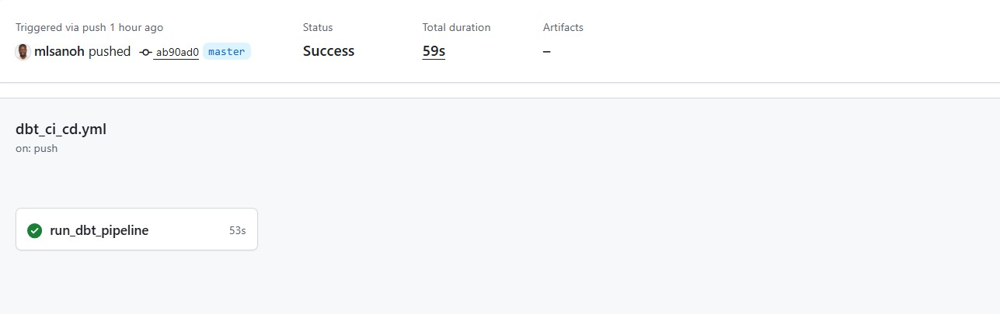

# 🚀 Modern Data Stack de Production (Azure • Snowflake • dbt • Airflow • Docker)

[](https://github.com/ton-username/Modern-Data-Stack-de-Production-Azure-Snowflake-dbt-Airflow-Docker/actions)


## 📌 Présentation du Projet
Ce projet implémente une **Modern Data Stack (MDS)** complète et industrialisée, simulant un environnement de production réel. L'objectif est d'orchestrer l'ingestion, la transformation, le test et le déploiement continu de données brutes stockées sur Azure vers un entrepôt de données Snowflake, en utilisant les meilleures pratiques du marché (Infrastructure as Code spirit, conteneurisation, CI/CD, et tests de qualité de données).

## 🏗️ Architecture Technique
L'architecture globale du projet repose sur un flux ELT (Extract, Load, Transform) robuste :


## 🛠️ Stack Technologique & Rôles
- **Orchestration :** ``Apache Airflow`` exécuté sous Docker Compose pour planifier et surveiller les pipelines de données (DAGs).

- **Stockage Source :** ``Azure Blob Storage`` agissant comme notre Data Lake / zone d'atterrissage des données.

- **Data Warehouse :** ``Snowflake`` séparé en couches distinctes (RAW pour l'ingestion, ANALYTICS pour les utilisateurs finaux).

- **Transformation & Qualité :** ``dbt (Data Build Tool)`` pour modulariser le code SQL (tables, vues, incrémentiel) et valider l'intégrité des données via des tests.

- **CI/CD :** ``GitHub Actions`` pour automatiser l'installation de l'environnement, la validation du profil et l'exécution des tests dbt à chaque modification (``dbt build``).

## 💻 Visualisation de la Production

### 1. Orchestration des DAGs (Apache Airflow)
Voici l'interface de suivi d'Apache Airflow affichant l'exécution réussie de notre DAG d'ingestion et de rafraîchissement. Chaque bloc représente une étape critique validée en production.


## 2. Validation de l'Intégration Continue (GitHub Actions)
Notre pipeline d'intégration continue compile et teste automatiquement l'ensemble de l'architecture dbt à chaque ``git push``.

- Statut : Passer au vert (Success ✅)

- Vérifications : Connexion Snowflake chiffrée, tests d'unicité, tests de non-nullité.




## 🚀 Installation et Déploiement
### Préréquis
- Docker & Docker Compose installés
- Un compte Snowflake actif
- Un accès à un conteneur Azure Blob Storage

### 1. Cloner le projet et configurer l'environnement

 ```Bash
 git clone [https://github.com/mlsanoh/Modern-Data-Stack-de-Production-Azure-Snowflake-dbt-Airflow-Docker.git](https://github.com/ton-username/Modern-Data-Stack-de-Production-Azure-Snowflake-dbt-Airflow-Docker.git)
cd Modern-Data-Stack-de-Production-Azure-Snowflake-dbt-Airflow-Docker
```

### 2. Lancer l'environnement d'orchestration (Airflow & Docker)

Démarrez la stack locale Airflow conteneurisée :
```Bash
docker-compose up -d
```
Accédez à l'interface Airflow sur ``http://localhost:8080`` (Identifiants par défaut : ``airflow / airflow``).

### 3. Exécuter le projet d'analyse avec dbt

Configurez vos variables d'environnement locales ou votre fichier profiles.yml, puis lancez la compilation manuelle :
```Bash
cd dbt_transformation
dbt deps
dbt build --target dev
```

## 📊 Modélisation d'Analyse (dbt)
Le projet d'analyse dbt structure la donnée selon le framework classique :

1. **Staging (``stg_``) :** Nettoyage primaire, renommage des colonnes, et typage correct des données brutes de Snowflake (``RAW``).

2. **Intermediate (``int_``) :** Jointures complexes et logique métier intermédiaire.

3. **Mart (``fact_ / dim_``) :** Tables de faits et dimensions prêtes à être consommées par un outil de Dataviz (PowerBI / Tableau).

Chaque modèle est soumis à des tests stricts définis dans les fichiers de schéma .yml pour bloquer toute régression de donnée.